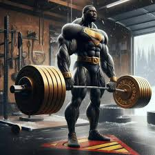

# Who am I?

> I am a student at Del Norte High School. I play both lacrosse and hockey. I like to go to the gym and lift weights with my dad. I am taking 3 AP courses this year including: APEL, AP CSP, AP Calc AB. I have 1 dog (a corgi named Kira) and 3 cats (2 bengals and 1 ragdoll).

# My favorite sports teams!

- Football: SF 49ers

- Hockey: LA Kings

# Weightlifting

> Along with hockey and lacrosse, I enjoy lifting weights with my friends and my dad. I spend a lot of my time in the gym and go 5 days a week.

#### Lifting PRs 💪💪

| Lift | Weight (lbs) |
| ---- | ----------- |
| Bench Press | 205 |
| Back Squat | 315 |
| Clean | 255 |
| Deadlift | 345 |
| Front Squat | 255 |
| Snatch | 155 |

